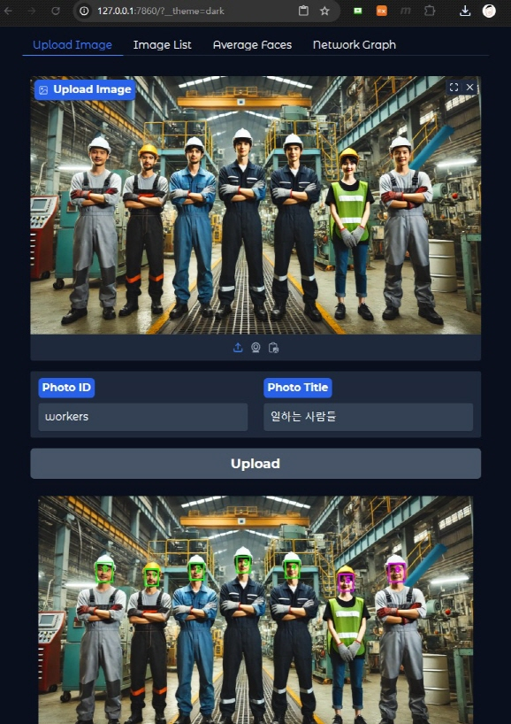
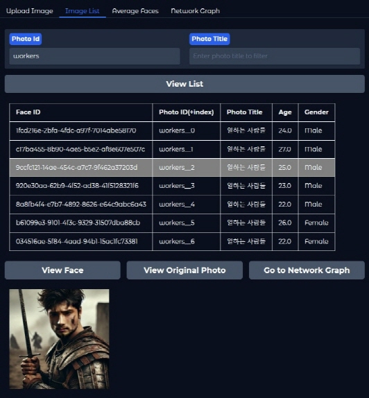

# Huchu Project

**Huchu 프로젝트**는 2025년 3월 한 달 동안, UI 프레임워크(Gradio, Streamlit 등), Object Storage, Vector DB, Graph DB 등 다양한 기술을 학습하고 경험하기 위한 개인 소프트웨어 개발 프로젝트입니다. 프로젝트 기반 학습(Project-Based Learning)을 지향하며, 결과 자체보다는 학습 과정과 경험에 초점을 맞추고 있습니다.

"Huchu(후추)"는 6개월 된 고양이의 이름이며, 최근 상한 음식을 먹고 세상을 떠났습니다. 이번 프로젝트는 후추를 추모하는 마음을 담아 이름 붙여졌습니다.

---

## ✨ 프로젝트 특징

### 🚀 시간 효율 우선
- 최대한 GenAI에 의존. (직접 할 수 있어도 GenAI에 위임)
- 빠른 실현을 목표로 하며, Test-Driven 개발이나 Clean Code 등 팀 협업에서 중요한 개발 원칙은 생략.
- 모르면 넘어감.

### 🧩 학습 효과 우선
- 확장성을 위해 추상화 설계에 신경 씀
- Cloud Native 지향: 컨테이너화 및 스케일 인/아웃 가능해야 함
- "몰라서 넘긴 것"은 반드시 나중에 알아냄

---

## ✅ 프로젝트 전개

### 1. 서비스 컨셉
- 앱 개요 : 경량 얼굴인식 AI 모델을 활용. UI를 통해 사용자들이 얼굴 사진을 업로드하고, 주기적으로 평균 얼굴을 계산해서 가장 평균 얼굴에 가까운 얼굴이 Win 하는 게임 앱. 또는, 자신과 얼굴적으로(?) 가까운 사람을 찾아주는 소셜 앱
- 과거 "AI가 그린 한국인 평균 얼굴" 기사에서 착안, **"회사를 대표하는 얼굴을 찾아라"** 이벤트성 앱 구상

### 2. 필요한 기술 정의
1. 이미지,얼굴 분석 및 조작
    - openCV : Visioning 기본 도구
    - insightface : 얼굴 분석 및 교체
    - codeformer : 이미지 복구(restoration)
    - onnxruntime : `.onnx` 타입 AI 모델 실행 엔진
    - pytorch : `.pth` 타입 AI 모델 실행 프레임워크
2. Web framework
    - Gradio : 빠른 UI 개발 유리
    - FastAPI : 동시 요청 처리, 확장성을 위해 Gradio app을 FastAPI app에 mount 하고 Web 서버는 Uvicorn 사용
    - jinja2 : 사용자 정의 html 구현을 위해 사용
3. Database
    - Qdrant : 안써봤다는 매력, 확장성, Cosine 유사성 함수기반 Top-N query 가능, ElasticSearch와 query 문법 비슷해서 선택
4. 파일 저장 및 배포
    - MinIO : Cloud를 사용하지 않는 한 달리 대안이 없었음

### 3. 테스트를 위한 대량 얼굴 데이터 확보
- https://mmlab.ie.cuhk.edu.hk/projects/CelebA.html

### 4. 앱 구현
1. UI를 통해 사진 촬영 및 업로드 (`Gradio`)
   
    
2. 얼굴 임베딩 추출 (embedding: 얼굴의 정체성을 표현하는 벡터) 및 저장
    - 녹색 box는 남자, 분홍 box는 여자, 붉은 box는 낮은 인식율(`det_score < 0.75`)로 제외. 숫자는 그림내 얼굴 식별번호
    - 유효하게 식별된 얼굴에 대한 embedding 정보와 기타 분석 정보를 `Vector DB`에 저장
  
    
3. 얼굴 검색 및 조회
    - 자신 또는 다른 사람이 등록한 얼굴과 원본 사진을 조회
    - 각각의 얼굴은 증명 사진 느낌의 Template에 옴겨져 조회됨
   
    
4. 평균 얼굴 생성 및 조회
    - 남녀가 같이 있는 Template 이미지에 평균 남녀 얼굴이 Update 되어 조회됨
   
    
5. 평균 얼굴 또는 특정 얼굴과 가장 유사한 얼굴 찾기
    - Network Graph를 통해 높은 유사도를 가진(`score > 0.2`) 얼굴들과의 관계를 시각적으로 보여줌
   
    
6. 얼굴 간 유사도를 관계로 하는 `Graph DB` 구성
    - <아직 진행 안함>

---

## 👤 평균 얼굴이란?

- 얼굴을 분석하면 아래와 같은 속성이 생성됩니다:
  - `bbox`, `kps`, `det_score`, `landmark_3d_68`, `pose`, `landmark_2d_106`, `gender`, `age`, `embedding`
- 이 중 **embedding**은 해당 얼굴의 정체성을 나타내는 길이 512의 1차원 벡터입니다.
> ⚡ embedding은 유전자처럼, 개별 얼굴의 핵심 정보를 담고 있음
- 여러 얼굴의 embedding을 평균 내면, 전체 얼굴을 대표하는 **center representation**이 됩니다.

- 3인 얼굴 사진:  
  

- 3인 + 평균 얼굴 임베딩 분포 시각화(512개의 요소 중 50개만 출력): 
  

- 평균 얼굴 이미지:  
  

> 실제로 평균 얼굴 이미지에는 **중립적이고 부드러운 인상**이 나타남

### 🧵 자주 묻는 질문

#### Q1. 평균을 낼수록 embedding 값이 0에 가까워져 의미 없어지는 거 아닌가요?
A. 아닙니다. 얼굴 임베딩은 방향성이 중요한 값입니다. 크기(길이)는 중요하지 않으며, 모델은 cosine similarity에 친화적으로 학습되어 있어 방향이 유사하면 유사한 얼굴로 판단합니다. 따라서 스칼라 곱, 평균 연산 등으로 값이 작아져도 의미는 유지됩니다.

#### Q2. 평균 얼굴인데 왜 잘생겼나요? 보통 얼굴처럼 생겨야 하지 않나요?
A. 평균은 개별 특징이 상쇄되어 **대칭적이고 부드러운 인상**이 강조되는 경우가 많습니다. 이는 사람들이 흔히 "잘생겼다"고 인식하는 특징과 일치할 수 있습니다.

---

## 📚 평균 얼굴 생성 과정 (code 예시)

### 1. 준비 모듈
- 라이브러리
```bash
pip install numpy opencv-python insightface
```
```python
import numpy as np
import cv2
from insightface import model_zoo
from insightface.app import FaceAnalysis
from insightface.app.common import Face
```
- 모델 (다운 받아 적당한 위치에 배치)
  - `buffalo_l` : https://github.com/deepinsight/insightface/releases
  - `inswapper_128` : https://huggingface.co/ezioruan/inswapper_128.onnx/tree/main
### 2. 얼굴 임베딩 추출
```python
detector = FaceAnalysis(name='buffalo_l', root="<buffalo_l model path>")
detector.prepare(ctx_id=-1)

image = cv2.imread("three_faces_image.jpg")
faces = detector.get(image)

emb1 = faces[0].embedding
emb2 = faces[1].embedding
emb3 = faces[2].embedding
```

### 3. 평균 임베딩 생성
```python
center_emb = np.mean([emb1, emb2, emb3], axis=0)
```

### 4. 평균 임베딩을 빈 껍데기 Face 객체에 주입
```python
mean_face = Face()
mean_face.embedding = center_emb
```

### 5. template 이미지 설정
> template 이미지 = 평균 임베딩을 적용할 **깔판 이미지**

```python
template_image = cv2.imread("template_image.jpg")
template_face = detector.get(template_image)[0]  # 얼굴 하나만 존재
```

### 6. 평균 얼굴로 스와핑 및 저장
- `template_image`의 `template_face`를 `mean_face`로 바꿈
```python
swapper = model_zoo.get_model("<swapper_model_path>")
swapper.prepare(ctx_id=0)  # GPU 사용 시 0, CPU는 -1

mean_image = swapper.get(template_image, template_face, mean_face)
cv2.imwrite("mean_face_result.jpg", mean_image)
```

---

## 🧩 비유적 해석: 얼굴 생성은 세포 배양과 닮았다

- **embedding**은 마치 유전자 정보처럼 각 얼굴의 핵심을 담고 있음
- 여러 얼굴의 임베딩을 평균 내면, 줄기세포처럼 **잠재력을 가진 벡터**가 생성됨
- 이 임베딩을 **Template 얼굴(깔판 이미지)** 위에 이식하면
  → 마치 세포가 조직 위에서 자라듯, **새로운 얼굴 이미지**가 만들어짐

---

## 🚀 향후 발전 방향

- 유사도 기반 얼굴 추천 기능 추가 (예: 숨겨진 가족 찾기) (Graph DB 활용)
- 얼굴 간 관계 시각화 (Graph DB 활용)
- 평균 얼굴의 시계열 변화 추적 등
- 얼굴 외에 다른 특징(음성, 글 등)으로 확장 가능성 탐색

## 📦 앱 설치 및 실행 방법
- 설치 및 실행 매뉴얼: [설치 및 실행 매뉴얼 바로가기](/docs)
