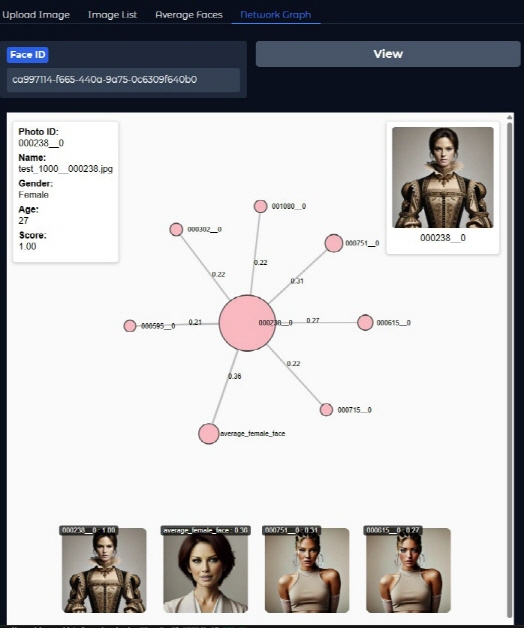
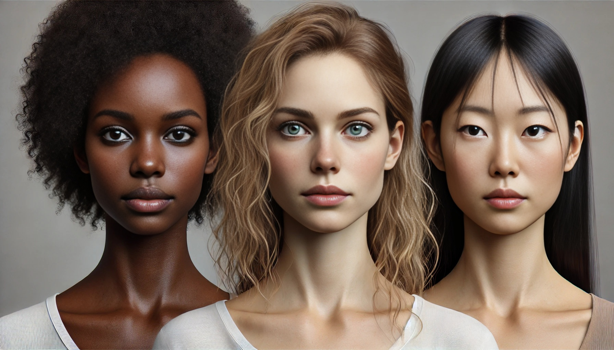
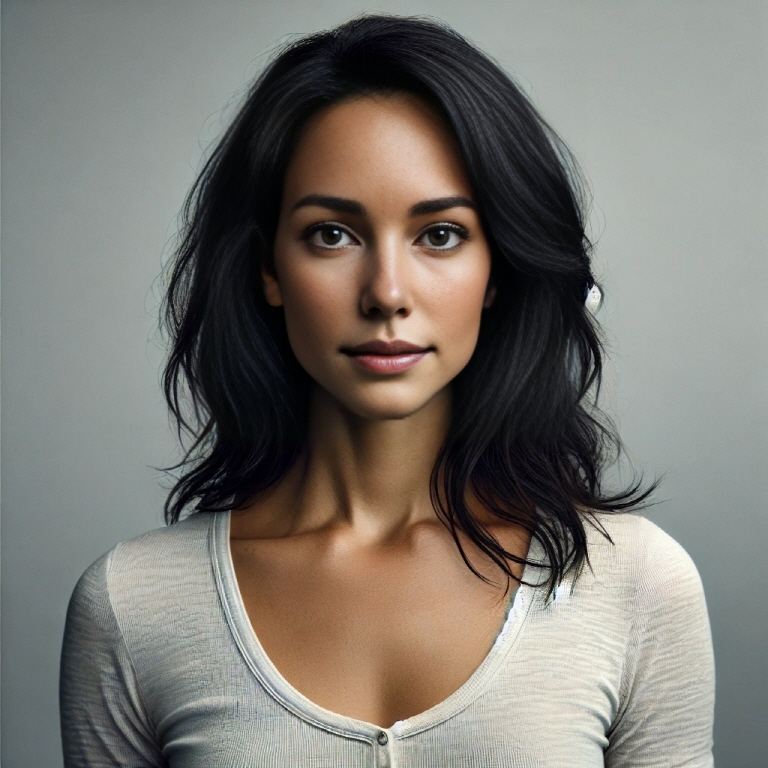

[](https://hits.sh/github.com/tanminkwan/hits/)
---
### 한국어 README 는 
---
# Huchu Project

The **Huchu Project** is a personal software development project running throughout March 2025, aimed at exploring various technologies such as UI frameworks (Gradio, Streamlit, etc.), Object Storage, Vector DBs, and Graph DBs. This project follows a Project-Based Learning approach, prioritizing the learning process and experience over the final outcome.

"Huchu" was the name of a 6-month-old cat who recently passed away after consuming spoiled food. This project is named in remembrance of Huchu.

---

## ✨ Project Highlights

### 🚀 Time Efficiency First
- Rely as much as possible on GenAI (even for tasks that could be done manually).
- Prioritize quick implementation over traditional best practices like Test-Driven Development or Clean Code.
- Skip what is not understood immediately.

### 🧩 Learning Effect First
- Focus on abstraction and scalability in design.
- Cloud-Native oriented: Must be containerized and capable of scaling in/out.
- Anything skipped due to lack of knowledge must be revisited later.

---

## ✅ Project Execution

### 1. Service Concept
- **App Overview**: A lightweight facial recognition AI-based game/social app where users upload face images. Periodically, an "average face" is computed, and the face closest to this average is declared the winner. Alternatively, the app can help users find others with similar facial features.
- Inspired by past articles like **"The Average Face of Koreans Drawn by AI"**, conceptualized as an event-based app: **"Find the Face that Represents Your Company!"**

### 2. Required Technologies
1. **Image & Face Analysis**
    - `openCV`: Core vision processing tool
    - `insightface`: Face analysis and swapping
    - `codeformer`: Image restoration
    - `onnxruntime`: Execution engine for `.onnx` AI models
    - `pytorch`: Framework for running `.pth` AI models
2. **Web Framework**
    - `Gradio`: Rapid UI development
    - `FastAPI`: Manages concurrent requests and scales efficiently. The Gradio app is mounted on a FastAPI app, and Uvicorn is used as the web server.
    - `jinja2`: Used for custom HTML rendering
3. **Database**
    - `Qdrant`: Chosen for its novelty, scalability, cosine similarity-based Top-N querying, and Elasticsearch-like query syntax.
4. **File Storage & Deployment**
    - `MinIO`: The best alternative when not using cloud storage.

### 3. Obtaining Large-Scale Face Data for Testing
- [CelebA Dataset](https://mmlab.ie.cuhk.edu.hk/projects/CelebA.html)

### 4. App Implementation
1. **Upload and Capture Face Images via UI** (`Gradio`)

    
2. **Extract Face Embeddings and Store Data**
    - Green box: Male, Pink box: Female, Red box: Low confidence (`det_score < 0.75`, excluded).
    - Valid faces are stored in a `Vector DB` along with their embeddings and metadata.

    
3. **Search and View Faces**
    - Browse previously uploaded face images.
    - Faces are cropped and displayed as ID-style photos.

    
4. **Generate and Display Average Faces**
    - A composite image overlays the computed average face onto male and female template images.

    
5. **Find Faces Most Similar to the Average Face or a Specific Face**
    - Displays a **network graph** showing relationships between faces with similarity scores above `0.2`.

    
6. **Build a Graph DB Representing Facial Similarities** *(Pending)*

---

## 👤 What Is an Average Face?

- Face analysis generates attributes like:
  - `bbox`, `kps`, `det_score`, `landmark_3d_68`, `pose`, `landmark_2d_106`, `gender`, `age`, `embedding`
- The **embedding** is a unique 512-dimensional vector representing facial identity.
> ⚡ Like DNA, an embedding encodes an individual's facial identity.
- The **center representation** is calculated by averaging multiple embeddings.

- **Three-person face photo:**  
  

- **Embedding distribution visualization (50 out of 512 values displayed):**  
  

- **Generated average face image:**  
  

> Average faces tend to have **neutral and soft features**.

### 🧵 FAQs

#### Q1. Does averaging embeddings make them meaningless by bringing values closer to zero?
A. No, face embeddings rely on direction rather than magnitude. AI models trained with cosine similarity remain effective even if embedding values decrease in size.

#### Q2. Why does the average face look attractive instead of ordinary?
A. The averaging process cancels out extreme features, often emphasizing **symmetry and smoothness**, which align with common perceptions of attractiveness.

---

## 📚 How to Generate an Average Face (Code Example)

### 1. Install Required Modules
```bash
pip install numpy opencv-python insightface
```
```python
import numpy as np
import cv2
from insightface import model_zoo
from insightface.app import FaceAnalysis
from insightface.app.common import Face
```
- **Download required models:**
  - `buffalo_l`: [Download](https://github.com/deepinsight/insightface/releases)
  - `inswapper_128`: [Download](https://huggingface.co/ezioruan/inswapper_128.onnx/tree/main)

### 2. Extract Face Embeddings
```python
detector = FaceAnalysis(name='buffalo_l', root="<buffalo_l model path>")
detector.prepare(ctx_id=-1)

image = cv2.imread("three_faces_image.jpg")
faces = detector.get(image)

emb1 = faces[0].embedding
emb2 = faces[1].embedding
emb3 = faces[2].embedding
```

### 3. Compute the Average Embedding
```python
center_emb = np.mean([emb1, emb2, emb3], axis=0)
```

### 4. Inject Average Embedding into a Placeholder Face Object
```python
mean_face = Face()
mean_face.embedding = center_emb
```

### 5. Set Template Image
```python
template_image = cv2.imread("template_image.jpg")
template_face = detector.get(template_image)[0]  # Only one face should be present
```

### 6. Swap Template Face with the Average Face
```python
swapper = model_zoo.get_model("<swapper_model_path>")
swapper.prepare(ctx_id=0)  # Use 0 for GPU, -1 for CPU

mean_image = swapper.get(template_image, template_face, mean_face)
cv2.imwrite("mean_face_result.jpg", mean_image)
```

---

## 🚀 Future Directions
- Add similarity-based face recommendations (e.g., "Find a long-lost relative") using Graph DB.
- Visualize face relationships via Graph DB.
- Track average face evolution over time.
- Expand beyond faces (e.g., voice, handwriting analysis).

## 📦 Installation & Execution
- See the [Installation Guide](/docs) for setup instructions.

